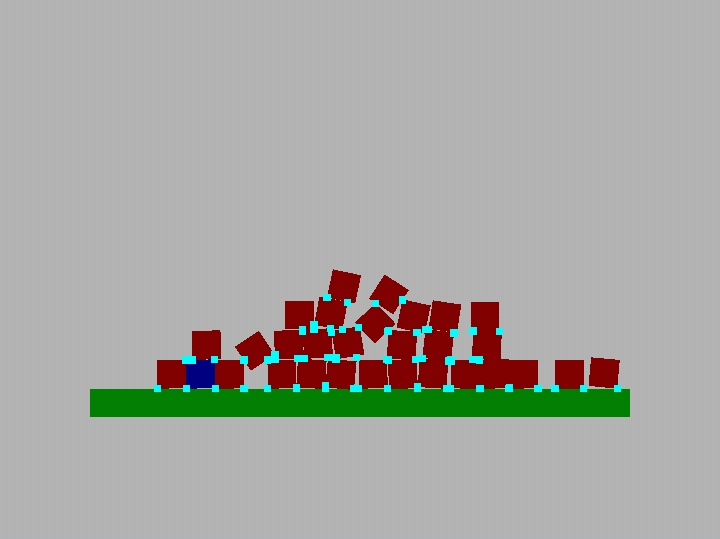

# CubevecEngine
2D physics engine in C

This engine is still currently unstable.

# version 0.0.2
 see update_log.txt
# Todo
• fix rect collision

• implement triangle collision

• implement circle collision

• implement convex collision

• apply impulse with moment of inertia

• apply friction 

• implement collision pipeline 

• add broadphase collision stage

• add narrowphase collision stage

# Future plans
• better SIMD support

• stable 2D simulation

• C++/Rust interface

• 3D support
